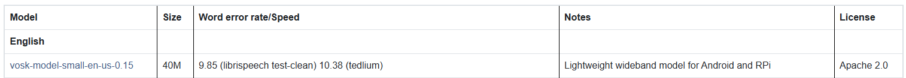
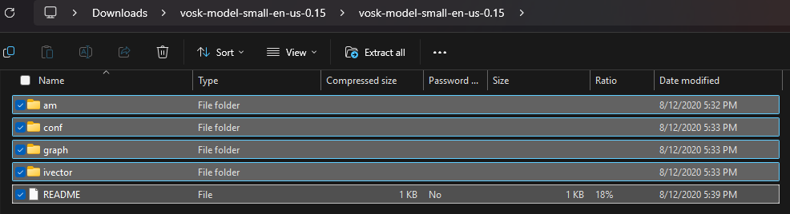

# ecse-toy

# High-level Instructions

## Setup
1. Prerequisite: Have Java and JDK installed.
2. Pull the latest changes from the main branch.
3. Download the **vosk-model-small-en-us-0.15** speech to text model from this link: https://alphacephei.com/vosk/models

4. Copy the following contents from the downloaded folder.

Create a “Model” Folder under `src/main/java` in the project, and paste the contents into the `src/main/java/Model` folder (do this through the file explorer or smth).

5. In the terminal, in the root directory of the project (should just be the ecse toy folder), run the following one by one:
- `.\mvnw.cmd clean install`
- `.\mvnw clean compile`
- `.\mvnw javafx:run`

(For Windows. If using Unix, look up the commands for that which should be similar). This should open the user interface.

## Important for connecting to low-level
1. Currently, the voice input can be taken when the play button on the interface is pressed. Speak, and then click the stop button once done. Soon you will see your text get printed in the terminal.

> [!NOTE]
> Because there is no OpenAI credit at the moment, the response generation function simply returns a placeholder text, “Placeholder response” every time. (The function itself is written but we will add credit later)

2. These use the functions `startRecording()` and `stopRecording()` in the `SpeechToText.java` file under the `src/main/java/tss` folder. If we want to use low level logic to record the voice instead (e.g. holding a button in the Mario toy to record), then you can try to connect that logic to trigger these functions on pressing and letting go etc.

3. Audio input and output are currently both tied to the PC right now. The input endpoint is in SpeechToText.java, and the output endpoint is in TextToSpeech.java. To relocate these to the toy, ideas are to use a bluetooth mic and speaker connected to the PC, or you can alter these functions to use the PCB components etc.

## Other info for interest:
Most of the logical files are in `src/main/java/tss`. `UserInterfaceController.java` is what controls the user interface, and this class uses the various service classes like `SpeechToText`, `TextToSpeech`, and `ChatGeneration` during its lifecycle which handles the request and responses.